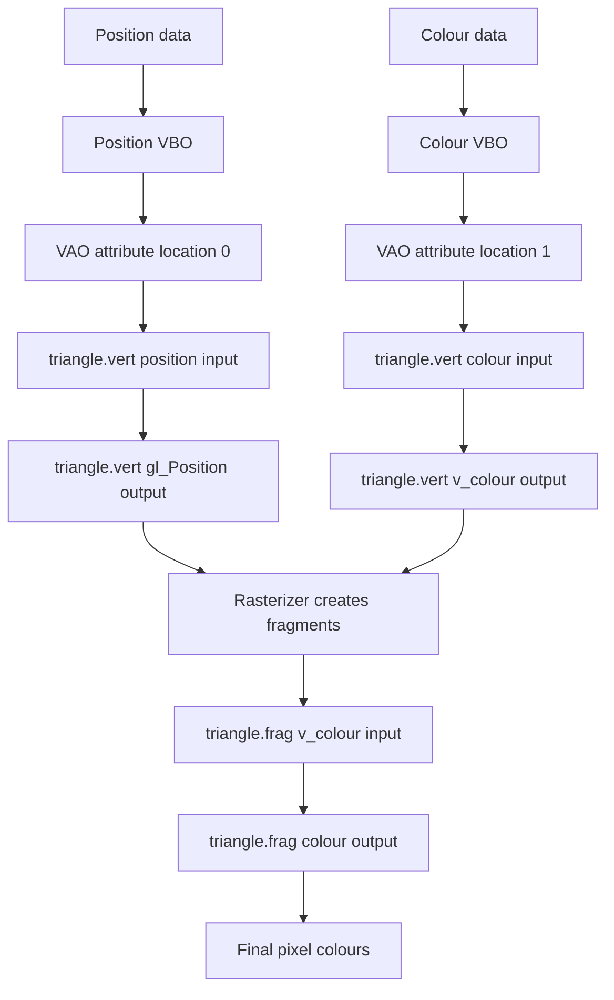

# 42_humangl

### To run:
```
make re && ./humangl
```

---

### Resources
- https://www.youtube.com/playlist?list=PLvv0ScY6vfd9zlZkIIqGDeG5TUWswkMox


### Graphics pipeline overview


```mermaid
flowchart TD
    A[Position data] --> B[Position VBO]
    C[Colour data] --> D[Colour VBO]
    B --> E[VAO attribute location 0]
    D --> F[VAO attribute location 1]
    E --> G[triangle.vert position input]
    F --> H[triangle.vert colour input]
    H --> I[triangle.vert v_colour output]
    G --> J[triangle.vert gl_Position output]
    J --> K[Rasterizer creates fragments]
    I --> K
    K --> L[triangle.frag v_colour input]
    L --> M[triangle.frag colour output]
    M --> N[Final pixel colours]
```
